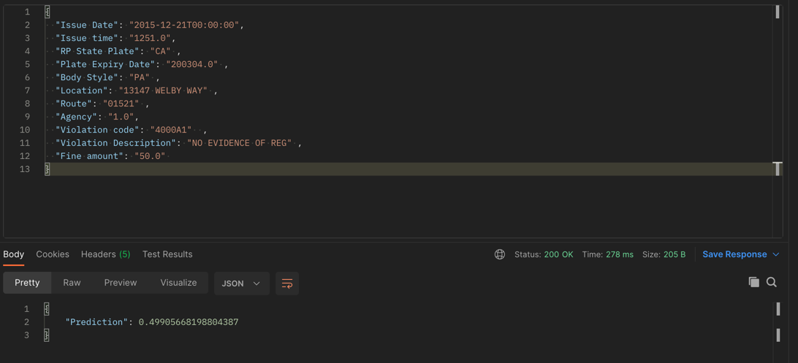

# Applied Machine Learning Scientist Assessment

In this assessment, We are trying to predict if the 'Make' of a vehicle is from one of the top25 manufacturers based on
the other features. Test the pipeline by first running the cleanup file and using the command

``
$ cleanup.sh
``


We provide the working end2end code, it can be run by running the following command.

``
$ run.sh
``


The pipeline of the ``run.sh`` is given below,

1. Creates an environment if conda exists otherwise it throws an error 
2. Installs the necessary packages
3. Runs the ``model.py`` file to train the multiple models mentioned in the later sections
4. Sets up the flask web server to run the application 


# Exploratory Data Analysis
The detailed steps and results for these are present in ``eda.ipynb``. The steps performed are as below
1. Separate out the corrupted rows by using the Make column in the features
2. Look at the number of missing values per feature and drop the features which have a lot of missing values
3. We ideally want to store features which have high variance of values. We drop the ones which have low variance or if the variance is almost as high as the number of rows.
4. We then visualize some of the important features that would be useful in making the classification.
5. We then see the range of values for each feature and decide if we want to keep them or drop them.


The list of features that were dropped are


Feature | Reason for dropping
---- | ----
Make | It was used to create the ground truth label so including this would cause a data leak with the model and would also lead to other problems as well
Meter Id | More than 80% of the values were missing
Marked Time | More than 90% of the values were missing
VIN | More than 90% of the values were missing
Ticket Number | Dropped because it had too many unique values, would not add too much of value to the model

The ground truth was calculated using the counts of the different 'Make's of all the data instances. 

The rest of the features that were considered in modelling the solution.  

# Model Configuration
There were 2 models that were used. A baseline was built and then another model was built to improve the performance. The results are as shown below

Model | Accuracy
---|---
Logistic Regression Model (Baseline) | 52.00%
AdaBoost Model | **62.24**%


## Baseline Model 

A simple logistic regression model was built after the EDA. The advantages of the simple logistic regression model are

* Memory Efficient model
* Easily trainable and interpretable model
* Very fast inference time

and the Drawbacks of using this model on this data
* Low accuracies (as shown in the table above)
* Learning happens at the superficial level
* Linear boundaries are constructed


## AdaBoost Model

This model combines several weak classifiers to provide a classification for each data instance. A combined classification means that we are getting a strong learner and a classifier.
The advantages of this model are,

* Less prone to Overfitting
* Improved Accuracies 
* Reducing Bias and Variance

The disadvantages of using these kind of models are,

* Sensitive to outliers and moise in the data
* slower than other boosting algorithms


Ideally to generate more complex relationships and a much better model we can leverage the use of Deep Neural networks and obtain much better accuracies. 

# Server Configuration

We create the server using Flask as the backend. The Flask server is usually deployed on `localhost:5000` and it the link should be available after running the `run.sh`. We use the `/predict` endpoint and it is configured to accept a .json input as shown below
The predict function uses the trained model from the `.pkl` to produce the output probability

```
{
  "Issue Date": "2015-12-21T00:00:00",
  "Issue time": "1251.0",
  "RP State Plate": "CA" ,
  "Plate Expiry Date": "200304.0" ,
  "Body Style": "PA" ,
  "Location": "13147 WELBY WAY" ,
  "Route": "01521" ,
  "Agency": "1.0",
  "Violation code": "4000A1"  ,
  "Violation Description": "NO EVIDENCE OF REG" ,
  "Fine amount": "50.0" 
}
```

The server returns a json with Probability of the car being a make in the top 25 car categories as shown below.
```
{
    "Prediction": 0.49905668198804387
}
```
This server was tested with Postman to send POST requests and get the output shown below


#Notes

1. **The Application has been tested on MAC OS**
2. Please change the permission of the `run.sh` by doing the `chmod +x run.sh` 
3. If you want to run the `cleanup.sh` by doing the `chmod +x cleanup.sh`


